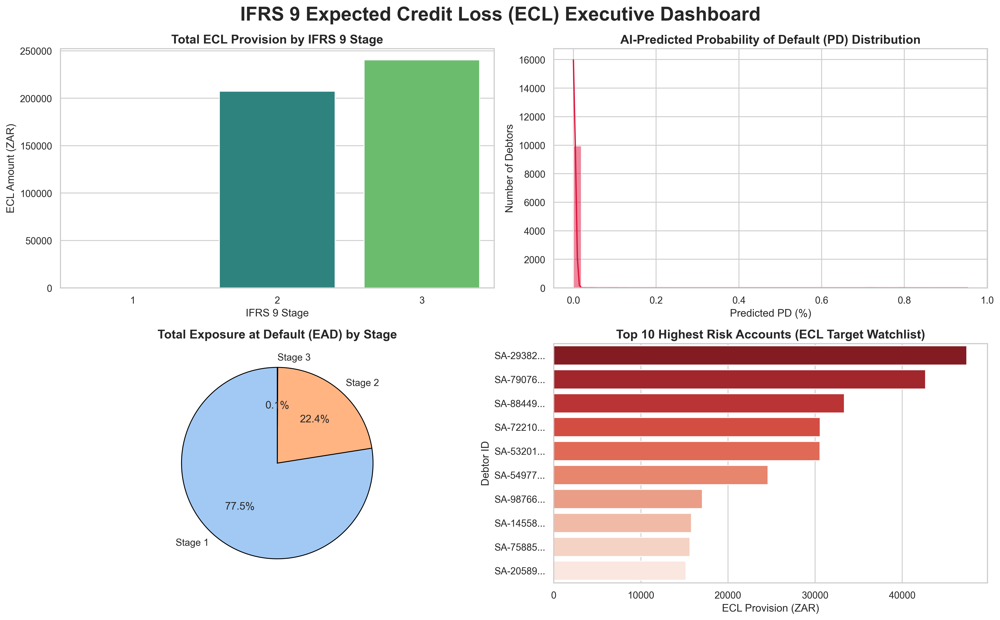
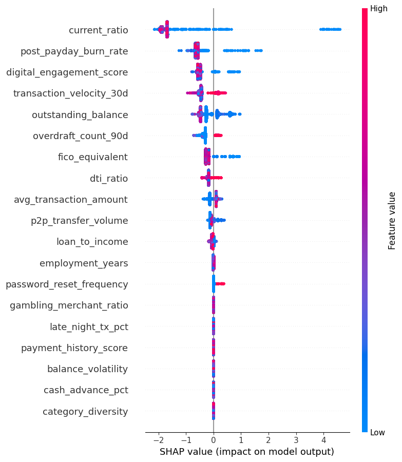

# 🏦 IFRS 9 Expected Credit Loss (ECL) AI Engine


## 📌 Executive Summary
This project is an enterprise-grade, end-to-end quantitative risk data science or credit risk model pipeline designed to calculate Expected Credit Loss (ECL) provisions in strict accordance with the **IFRS 9 Regulatory Standard**. 

Unlike traditional static actuarial models, this engine integrates **Machine Learning** to dynamically predict Probability of Default (PD) and detect behavioral anomalies, merging advanced data science with strict banking regulations. 

The project encompasses a full data engineering pipeline, machine learning modeling, an actuarial math engine, automated testing, and an interactive executive web dashboard.

## 🤝 Collaboration
This enterprise quantitative risk engine was architected and developed in collaboration with **Masoma Shai**.

---

## 📸 Executive Dashboard & Auditing

### IFRS 9 Portfolio Risk Dashboard

*Interactive UI built with Streamlit allowing risk managers to filter the portfolio by IFRS 9 Stage, view total Exposure at Default (EAD), and sort high-risk accounts.*

### SHAP Explainability Auditor Report

*AI Model auditing using SHAP values to explain the driving factors behind Probability of Default predictions, ensuring regulatory transparency.*

---

## ⚙️ System Architecture & Pipeline

The system is built sequentially across 5 distinct phases:

1. **Synthetic Data Generation (`data_generator`)**
   * Generates a realistic, synthetic retail/SME banking portfolio.
   * Creates core variables including FICO equivalents, Days Past Due (DPD) buckets, Loan-to-Income ratios, and outstanding balances.
2. **AI Behavioral Anomaly Detection (`ml_pipeline`)**
   * Utilizes **Isolation Forests** to scan debtor behavioral data for hidden risk anomalies prior to outright default.
3. **AI Probability of Default Modeling (`ml_pipeline`)**
   * Utilizes an ML classifier to calculate a granular, forward-looking Probability of Default (PD) for every individual loan.
4. **IFRS 9 Actuarial Engine (`actuarial_engine`)**
   * Translates IFRS 9 legislation into strict Python logic.
   * **Stage 1:** Performing loans (12-month ECL).
   * **Stage 2:** Significant Increase in Credit Risk (SICR) triggered by PD multiples > 2.0x, 30+ DPD (without rebuttable presumption), or forbearance flags (Lifetime ECL).
   * **Stage 3:** Credit Impaired / 90+ DPD (Lifetime ECL).
   * Calculates the final Expected Credit Loss (ZAR) provision.
5. **Interactive Executive Reporting (`dashboard`)**
   * A Streamlit web application that queries the SQLite database in real-time to visualize provisions, high-risk accounts, and portfolio distribution.

---

## 🛠️ Technology Stack

* **Languages:** Python 3.10+
* **Data & Math:** Pandas, NumPy
* **Machine Learning:** Scikit-Learn (Isolation Forest), XGBoost, SHAP (for model explainability)
* **Database:** SQLite3 (`ifrs9_engine.db`)
* **Frontend:** Streamlit
* **DevOps & Testing:** Pytest, GitHub Actions (CI/CD)
---

## 🚀 Installation & "Cold Start" Guide
To run this project locally, you must execute the pipeline sequentially to build the local SQLite database.

**1. Clone the repository and install dependencies:**
```bash
git clone [https://github.com/TsoareloAdriaan11/IFRS9-ECL-ENGINE.git](https://github.com/TsoareloAdriaan11/IFRS9-ECL-ENGINE.git)
cd IFRS9-ECL-ENGINE
pip install pandas numpy scikit-learn xgboost shap streamlit pytest
```

**2. Run the Data Pipeline (Phase 1-3):**
```bash
python -m src.data_generator.generate_data
python -m src.ml_pipeline.anomaly_detector
python -m src.ml_pipeline.pd_model
```

**3. Run the Actuarial Math Engine (Phase 4):**
```bash
python -m src.actuarial_engine.ecl_calculator
```

**4. Launch the Interactive Dashboard (Phase 5):**
```bash
python -m streamlit run src/dashboard/app.py
```

---

## 🧪 Automated Testing (CI/CD)
This engine is secured by a rigorous `pytest` suite that runs automatically via GitHub Actions on every commit. The test suite mathematically proves the staging logic:

* Verifies 90+ DPD triggers Stage 3.
* Verifies 30+ DPD without successful rebuttal triggers Stage 2.
* Verifies relative PD jumps (e.g., > 2.0x multiple) trigger Stage 2.
* Verifies Stage 1 vs. Stage 2/3 Expected Credit Loss math (12-month PD vs Lifetime PD with discount factors).

To run the tests locally:
```bash
python -m pytest tests/
```

---

## 📂 Project Structure

```text
IFRS9-ECL-ENGINE/
│
├── src/
│   ├── data_generator/      # Synthetic banking data creation
│   ├── ml_pipeline/         # AI models (Anomaly Detection & PD Models)
│   ├── actuarial_engine/    # IFRS 9 Staging logic and ECL math
│   └── dashboard/           # Streamlit interactive UI
│
├── tests/                   # Pytest suite (Math verification & Database checks)
├── outputs/                 # Stores the generated ifrs9_engine.db SQLite database
├── assets/                  # Dashboard screenshots and SHAP reports
└── README.md
*Disclaimer: The data generated and used in this repository is entirely synthetic. This engine is a portfolio project and should not be used for live regulatory reporting without extensive secondary auditing.
            The use of AI is acknowledge in making this project a success*
